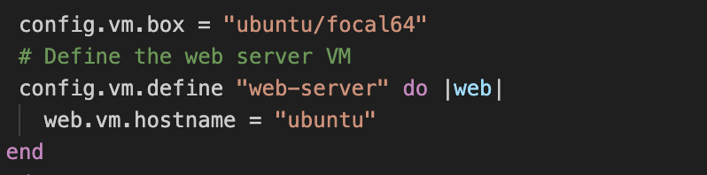

# Promotional Task Workflow

## Table of Contents

- [Promotional Task Workflow](#promotional-task-workflow)
  - [Table of Contents](#table-of-contents)
  - [Introduction](#introduction)
  - [Precaution](#precaution)
  - [Promotional task 4 Instructions](#promotional-task-4-instructions)
  - [Solution](#solution)

## Introduction

In the process of working on this project I made mistakes which lead to the loss of many important Recources.
Here are the task done on this project.

## Precaution

- Make sure you're running any script in a virtual environment like in vagrant or docker.
- Should you plan recreate this project in the future remember to learn about virtual environment and understand the shell commands so you can explain where an issue comes from should the case arise.

## Promotional task 4 Instructions

Attempt all questions. Upload code to Github and share the repository link
Use Functional Programming principles to make your code readable (DRY, KISS)
Do your research and find modules to help you accomplish your task. You can also create your own modules.

As a DevOps Engineer, you have been consulted to set up the infrastructure servers of a small business. Automate the creation of the following users and directories using Python.

1. Using Python, create the following users, and assign them to groups
Employees:

Andrew, System Administrator
Julius, Legal
Chizi, Human Resource Manager
Jeniffer, Sales Manager
Adeola, Business Strategist
Bach, CEO
Gozie, IT intern
Ogochukwu, Finance Manager

2. Using Python, create the following directories
Company Documents (Directories):

Finance Budgets
Contract Documents
Business Projections
Business Models
Employee Data
Company Vision and Mission Statement
Server Configuration Script

Include a feature that takes user input and creates a file in your code. User input should include:
Name of file
Directory to create the file
Don't create the file if the Directory name is not one of the company directories.

## Solution

- First task
  - set up vagrant virtual machine
    

  - install ubuntu os on the machine and access your shell
    
    

  - install python language on the machine
    
    
  - make a directory for the project
    
  - write a function to create user, create group and assign user to a group.
    
    
- second task
  - write a function to make directory on the projects
  - added conditions to prevent any directory that's not listed to be created